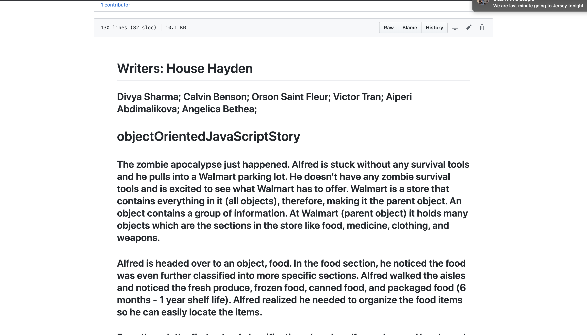

# object-oriented-js-story

## This is a summation of object oriented javascript. The first half of this describes different definitions in OOP that are analogous to items found at Walmart. The second part this describes definitions in depth.

